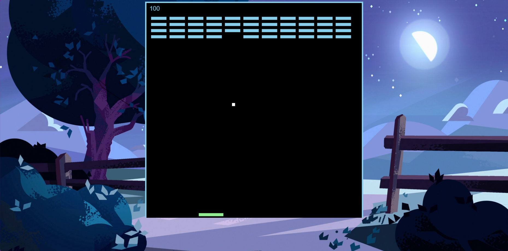
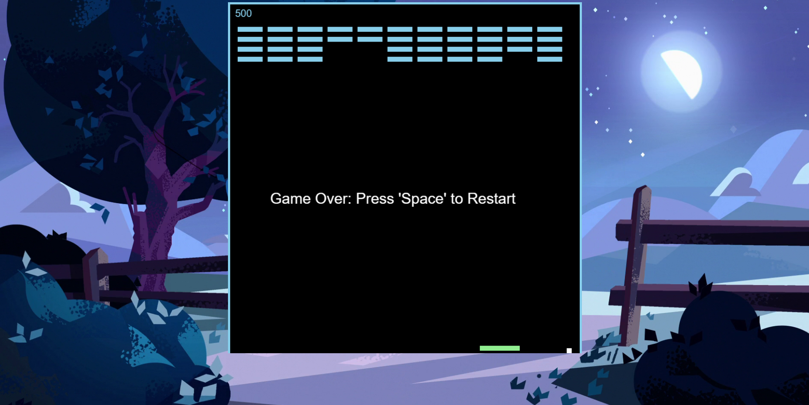

# Breakout Game

Breakout Game is a classic arcade game where the player controls a paddle to bounce a ball and break bricks. The game is built using HTML, CSS, and JavaScript.

## How to Play

- Use the left and right arrow keys to move the paddle.
- Bounce the ball off the paddle to break the bricks.
- Break all the bricks to complete the level.
- If the ball falls below the paddle game is over.

## Demo

You can play the game [here](https://sithumsankajith.github.io/breakout-web-game/).

## Screenshots

## Technologies Used

- HTML
- CSS
- JavaScript

## License

This project is licensed under the MIT License - see the [LICENSE](LICENSE) file for details.
